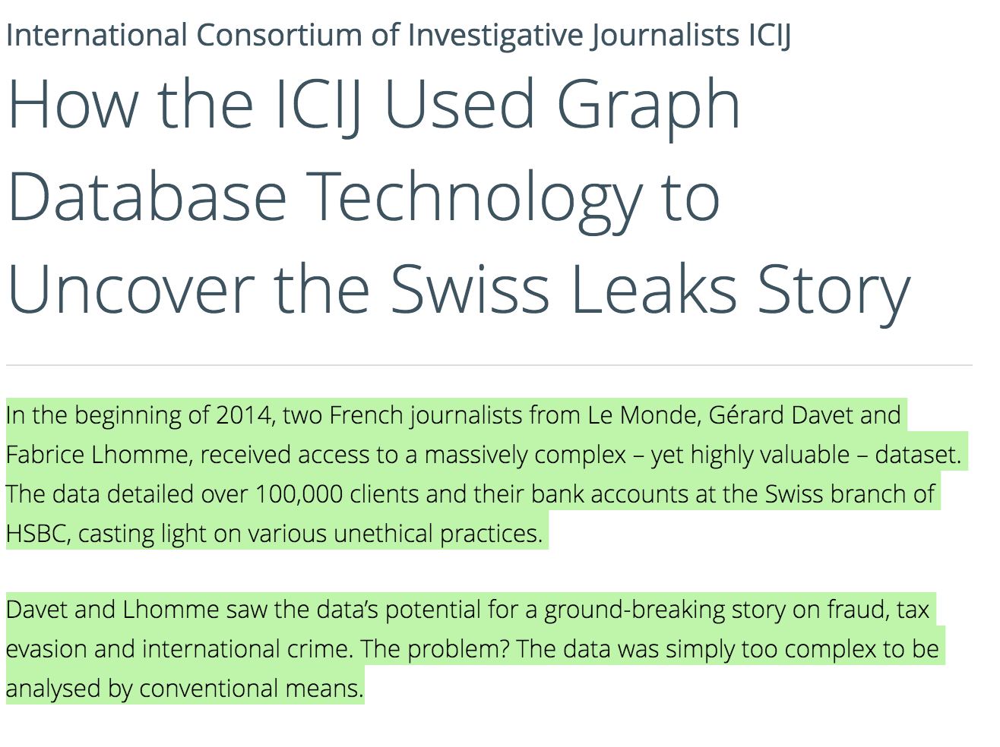
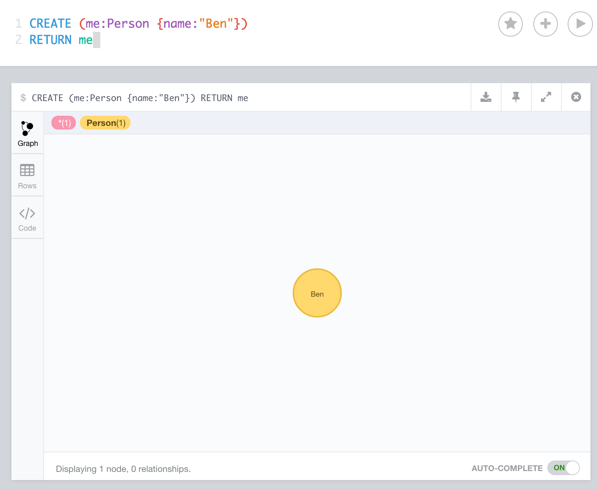
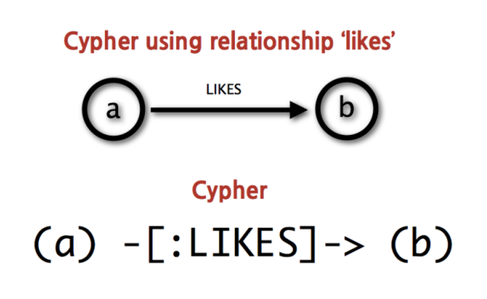
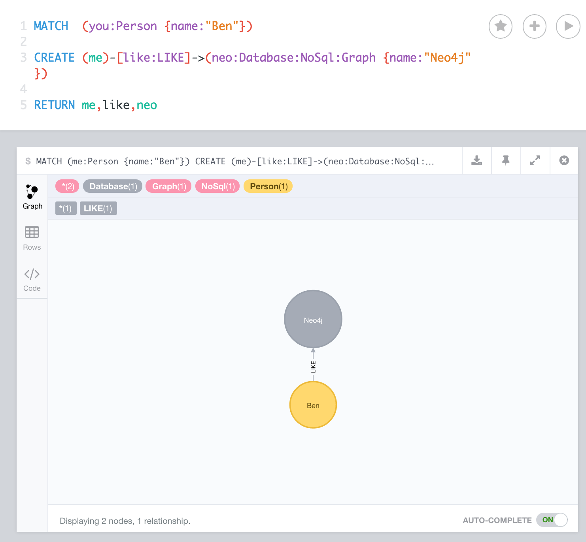
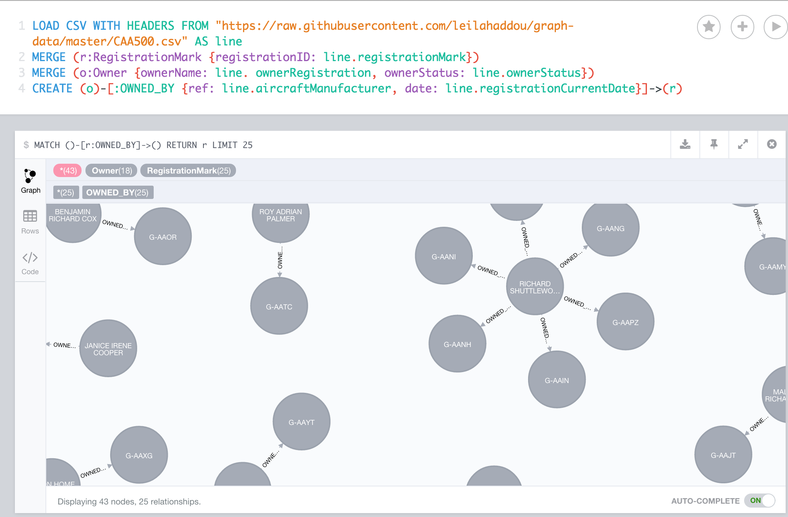
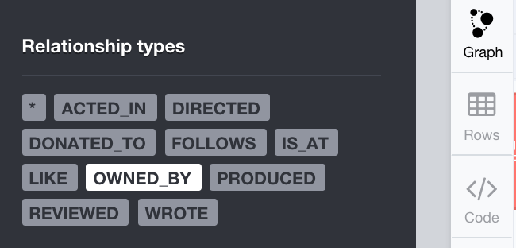
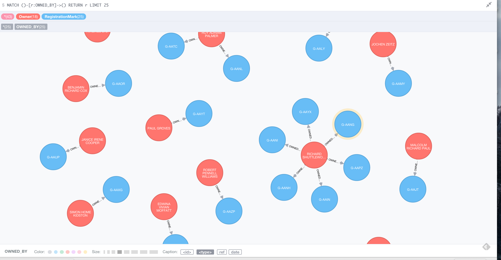
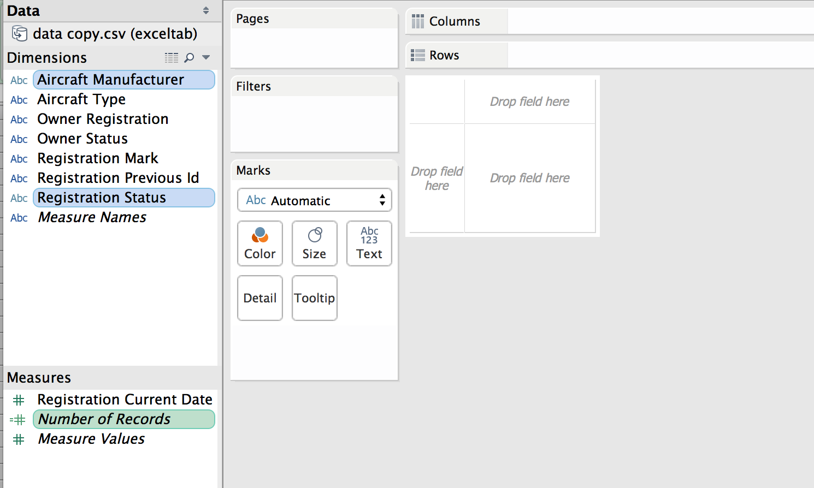
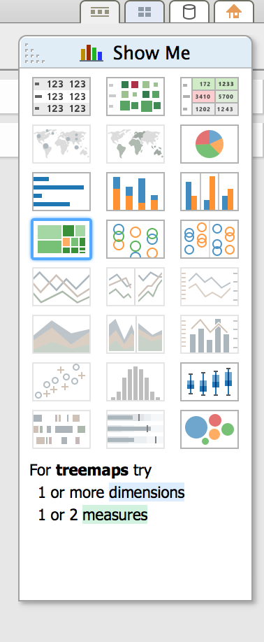
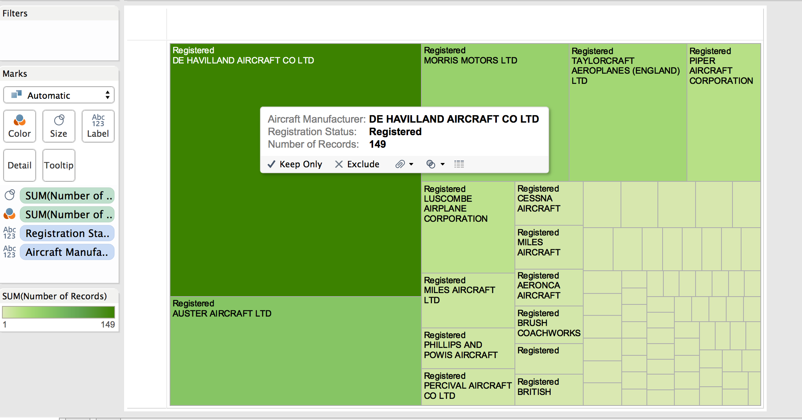

- [Neo4J](http://neo4j.com/) to explore networks with graph databases
- R together with R packages
- Python 
- Tableau
- Excel/google docs/open source programs
- QGIS/Argis for GeoData
- Apache Drill for Big Data

In this section of the course, we will touch Neo4J, some quick data analysis in R and other tools helping us to validate and analyse data. 

##Neo4J

“While working on stories like Offshore Leaks, I learned how important graph analysis is when investigating financial corruption," says Mar Cabra, editor of the Data and Research Unit at the ICIJ (International Consortium of Investigative Journalists (ICIJ). One reason more to tell you about Neo4j. Its particular good in helping you understand graph databases. 

Eventually, I hope we might see more stuff out there. Some real data journalism examples include for example the story on "[How the ICIJ Used Graph Database Technology Helped to Uncover the Swiss Leaks Story](http://neo4j.com/case-studies/icij/)". 

Graph databases include nodes, relationships and properties

In case you wander, here is what's a graph database: 
`In computing, a graph database is a database that uses graph structures for semantic queries with nodes, edges and properties to represent and store data. Graph databases employ nodes, properties, and edges.`

But how to get started. Good question! I think with a tangible example, many data journalists might get a better idea what it is. 

###Neo4J Tutorial
So lets get started. [The official website guides](http://info.neo4j.com/download-thanks.html?edition=community&flavour=osx&release=2.3.0&_ga=1.9430012.870875200.1446108022) you through the installation. A great book to start off with is Rik Van Bruggen's "Learning Neo4J". In chapter 5, you get a sense how to get your data into Neo4j. 

1. [Download](http://neo4j.com/download/) it and follow instructions on how to install it and run it on a local host (install Neo4j community edition visit the Neo4j Download page and follow the instructions and on your Mac, you are recommended to install via homebrew in the terminal instead).
2. once installed, go to [Localhost:7474/browser](http://localhost:7474/browser/)
3. Create a Record for Yourself

`CREATE (me:Person {name:"Ben"})
RETURN me`

Understanding Neo4js Nodes: 

`Cypher uses ASCII-Art to represent patterns. You'd surround nodes with parentheses which look like circles, e.g. (node). If we later want to refer to the node, we’ll give it an identifier like (p) for person or (t) for thing. In real-world queries, we’ll probably use longer, more expressive variable names like (person) or (thing). To illustrate, if we want to find all the persons and the things they like, the query will include the identifiers person and thing. We might use a pattern like (person)-->(thing) so we can refer to them later, for example, to access properties like person.name and thing.quality.`

3. Now create a simple 2-node relationship via 4. "CREATE (x:Label {property:"Value"})" via Neo4Js language cypher. 

Type into the Neo4j's console: 

`MATCH  (you:Person {name:"Ben"})
CREATE (me)-[like:LIKE]->(neo:Database:NoSql:Graph {name:"Neo4j" })
RETURN me,like,neo`

The relationship is written in square brackets in the centre. Spaces between words must have _ between them and notice how similar the code looks to the diagram we are building? I love easy syntax.

4. Reading in a CSV

Use the link for the cvs file here: 
`https://raw.githubusercontent.com/leilahaddou/graph-data/master/CAA500.csv`
It's a dataset of the plane ownership database held by the Civil Aviation Authority (thanks to [Leila Haddou](http://www.theguardian.com/profile/leila-haddou) for helping with her support)

`LOAD CSV WITH HEADERS FROM "https://raw.githubusercontent.com/leilahaddou/graph-data/master/CAA500.csv" AS line
MERGE (r:RegistrationMark {registrationID: line.registrationMark})
MERGE (o:Owner {ownerName: line. ownerRegistration, ownerStatus: line.ownerStatus})
CREATE (o)-[:OWNED_BY {ref: line.aircraftManufacturer, date: line.registrationCurrentDate}]->(r)`

Click then on "OWNED_BY", which we specified the relationship with, and then on the "Graph" symbol:

Lastly you can change the layout (colors, or Captions in the bottom if you enlarge the picture etc.)

Others have helped to support with additional resources on Neo4J (in case you are interested)

- Neo4j [website feature tutorials](http://neo4j.com/docs/stable/tutorials.html)

- Neo4j [meetups in London](http://www.meetup.com/graphdb-london/)

- [books](http://neo4j.com/books/) 

- [Linkurio.us](https://linkurio.us/visualizing-the-ties-between-big-pharmas-and-doctors-in-france/) blog

##Analysis in R

lets do some simple data analysis in R. Download the [data](https://raw.githubusercontent.com/kevinrobinson/mobile-learning-experience/master/edx-dataset/minutes_per_day.csv)

To support me in my work with R, I sometimes look at the cheatsheet here: 

[Cheatsheet1](https://cran.r-project.org/doc/contrib/Short-refcard.pdf): R Reference Card
[Cheatsheet2](https://drive.google.com/folderview?ddrp=1&id=0ByIrJAE4KMTtcVBmdm1BOEZoeEk): A collection on Google Drive

Data: It's an example on student data to see how long students spend on an education websites

Some packages such as dplyr and ggplot allow aggregate and visualize data more easily than if you used the base commands that come with R. I would also argue that the code is more semantic and easier to read. See if you can figure out what the code is doing.

1. Read the data into rStudio:
`data <- read.csv("https://raw.githubusercontent.com/kevinrobinson/mobile-learning-experience/master/edx-dataset/minutes_per_day.csv", header=T,
                 colClasses=c("integer",
                              "Date",
                              "integer"))`

2.Get a statistical summary of the data
`summary(data)`

3. Load in the library called dplyr
`library(dplyr)
avgdata <- data %>%
  group_by(date) %>%
  summarise(avg_minutes = mean(minutes_on_site))`
Note: dplyr helps to calculate the average time spend on the website each day

4. Load in a library called ggplot2
`library(ggplot2)
outputviz <- qplot(data=avgdata, x=date, y=avg_minutes) +
  geom_line() +
  geom_point()`
Note: Create a graph of average minutes on the website over the time preiod

5. (option) interactive dataviz on the web via plotly and ggplot:

`install.packages("plotly")
Sys.setenv("plotly_username"="benbenben")
Sys.setenv("plotly_api_key"="future1000")
library(plotly)
ggplotly(outputviz)`

#Tableau Analysis

It's great if you have a bunch of excel data. Download the public version [here](https://public.tableau.com/s/). Test it with a dataset here. Again, i used here the dataset from above on planes-ownership (just saved it as an excel sheet to read it in).

1. Load in the data via excel sheets, click then "go to sheets"

2. command-click the different inputs on your left

3. choose visualisations on the right

4. create a storyboard for exploring, and to export

You have to get an account if you want to share your visualisation on the web. To create the iframe is a bit of a pain, but hey, who can complain about how easy it is to create the interactive graphs. 
Downside is that Tableau's visualisation iframes are not responsive, but as you are in the section on "analysis", you wouldn't care at this stage.

##Geo Data

Here is my toolbox for GEO DATA:

1. QGIS: I use it to analyse and convert shape files into GeoJson, for interactive data viz on the web. Here is my [tutorial](http://datacandy.co.uk/choropleth_tutorial/index.html), and the output is visualised via leaflet.js

2. [Leaflet.js](http://leafletjs.com/) - very useful as it works with anything, and is really easy to use/learn

3. [Mapbox](https://www.mapbox.com/) - if you feel comfortable with tiles its great, but less of an explorative tool. Easy to use for projects with ruby and d3.js

4. ARCGIS - get a free account and upload your geo-data and [start exploring your data](https://developers.arcgis.com/en/sign-up/). The pro-version is not affordable (nowhere near), but the dev version is serving you well.

5. [CartoDB](https://cartodb.com/) - again somewhat free, still a bit of a pain to help CartoDB to understand your longitude and latitude. 

6. [To get for your place names long and lat, use the Google Maps Geocoding API (you need an API key for that)](https://developers.google.com/maps/documentation/geocoding/intro)

7. Maybe less for the analysis part, but useful when your want to analyse and output GeoData is a page called [mapshaper.org](http://www.mapshaper.org/). Extremely useful to reduce file size, or output in different formats. Also it helps your to initially validate and analyse your geojson/shapefile/topojson data with a single click.

8. [Gdal.org:](http://www.gdal.org/ogr2ogr.html) (among many uses) it helps you convert your data to other formats 

#For your Json Data in Particularly
1. to verify whether your data is in the right Json format (so javascript accepts it), I use [jsonlint.com](http://jsonlint.com/). Check it out, its awesome!

2. There is something similar for GeoJson data called [Geojson.io](http://geojson.io/). It helps you validating your GEOJSON data sets. Just trop the file in there.

