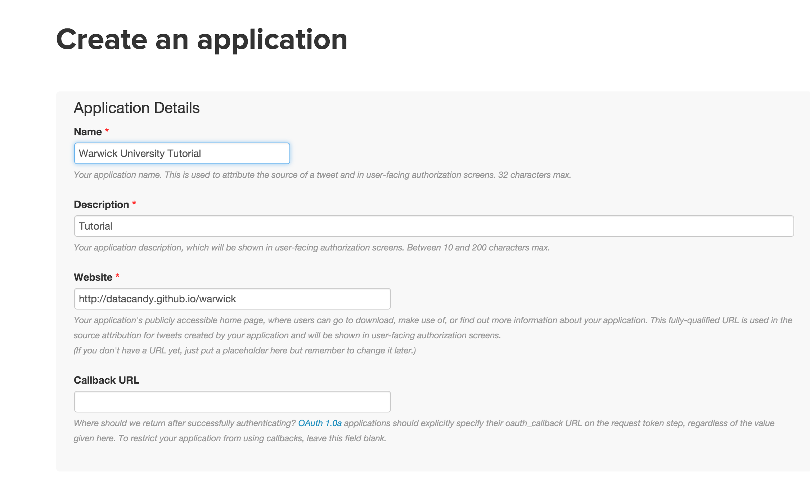
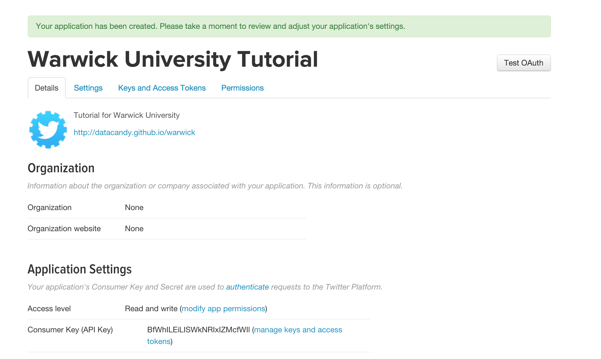
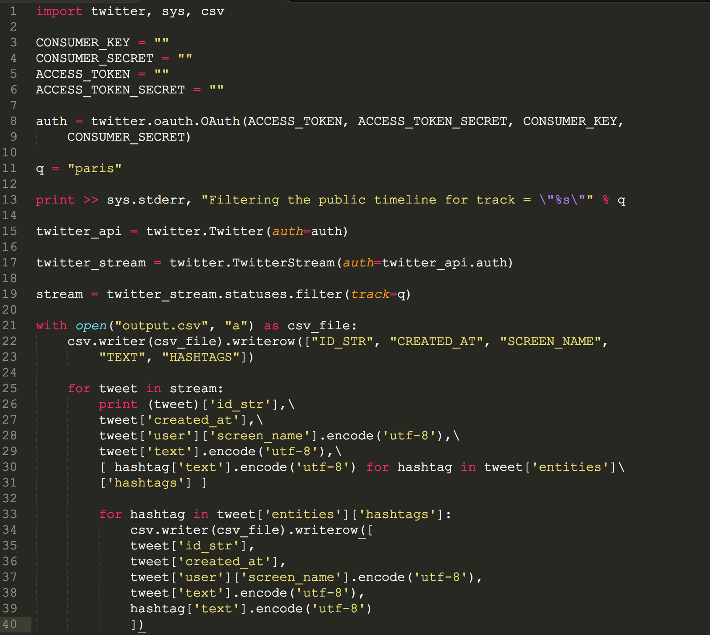

In this quick tutorial we will look at how to stream tweets from Twitter into a cvs file. 

Lets get started to stream some twitter data into a cvs file from where you can later do an analysis, or a visualisation from.

Open up the python [file](python/file.py): 

1. Create a twitter account. Then go to this [page](https://apps.twitter.com/), and create a new twitter app, fill in the details.

2. Access your Auth details.

3. Open the python file in your favourite text editor (mine is Sublime) and insert your Auth details. Check out the script, and think about what you want to look for. Here we specified a hashtag. The script will look into the stream (only about 1% of all tweets), and output the tweets that contain the hashtags name. Can you see how useful this is when there is any big news event happening, to collect what people think. Not part of this tutorial, but you could easily write a script to analyse the tweets on its sentiment.

How the script works:

Import the modules for twitter, sys and csv to be able to output the stream:
`import twitter, sys, csv
`
Twitter auth procedure
`CONSUMER_KEY = ""
CONSUMER_SECRET = ""
ACCESS_TOKEN = ""
ACCESS_TOKEN_SECRET = ""`

`auth = twitter.oauth.OAuth(ACCESS_TOKEN, ACCESS_TOKEN_SECRET, CONSUMER_KEY,
	CONSUMER_SECRET)`

define the query term (or add multiple query terms)
`q = "paris"`

The syntax means to write to a file object (sys.stderr in this case) instead of standard output.
`print >> sys.stderr, "Filtering the public timeline for track = \"%s\"" % q
`
Returns an instance of twitter.Twitter and references the self.auth parameter (more in detail [here](https://dev.twitter.com/docs/streaming-apis)).

`twitter_api = twitter.Twitter(auth=auth)
twitter_stream = twitter.TwitterStream(auth=twitter_api.auth)
stream = twitter_stream.statuses.filter(track=q)`

Here we set the column headings for the CSV file, define the filename:
`with open("twitter-hashtag-stream.csv", "a") as csv_file:
	csv.writer(csv_file).writerow(["ID_STR", "CREATED_AT", "SCREEN_NAME",
		"TEXT", "HASHTAGS"])`
		
Here we define the encoding, and the pick out the details for the cvs for the tweets and hashtags:
`for tweet in stream:...`
`for hashtag in tweet['entities']['hashtags']:...`

4. Save your file in a accessible spot
5. run the install for python if you want (I personally love python, its simple to use). The open Ipython in the command line (I'm on IOS). 
6. type "run" and then the file path of the python file you saved it under
7. Now the streaming API is running. Collect your cvs file in the folder you saved it in (specified in the python script)
8. Open it up, check out what you collected - ask yourself, if this is useful. 

 A simple example on how to use the streaming API and how to end up with an output that can help to tell data driven stories.