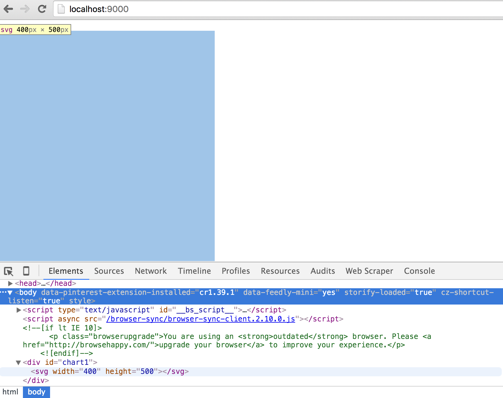

Javascript libraries for data Viz I used/used

- D3.js
- dc.js (based in d3)
- C3.js (based in d3)
- [Dimple.js (based in d3)](http://dimplejs.org/examples_index.html)
- sometimes [highcharts](http://www.highcharts.com/)
- [Plot.ly in javascript](https://plot.ly/javascript/) which we going to explore in a minute
- [Leaflet.js](http://leafletjs.com/examples/choropleth.html)
- Epoch.js for real time stuff (here a [blog post](https://www.fastly.com/blog/introducing-epoch) about it)
- graph-scroll.js (Simple scrolling events for d3 graphs. Based on stack)

##Setup:
before we get started to produce something for the browse window, lets install/download quickly [Yeoman](https://github.com/yeoman/generator-gulp-webapp#readme), which help me to get up an environment really quickly, plus it has a build in local server that updates any changes automatically (much nice to see your visualisation grow this way).

So above all of the libraries mentioned above, the one the possibly allow you to go wild and creative most is D3.js. 

##D3 tutorial: how to see something in the browser?

So lets start simple. In order to see any data bound in the browser, we need out local server to work (or cd in your directory of choice, and run a local server via python $ ). Once its running, in our HTML standard setup file we include:

`` for access Mike's library. I don't know about you, but i feel in the mood for a Scatterplot. This works with the SVG element of circles. 

1. firs we need to reference our chart with a div in the body via `

`. 
2. The in the <Javascript> tags, we can start with the magic (you can also reference a .js file)

3. lets set the scene with a svg element, which i always think of as the canvas to draw on. We specify width, height, and a padding value (in pixels). Then we select the div element and append an svg via d3

Check the console in Chrome, there you have it:

4. Next we need to load in a dataset. D3 helps us with d3.csv, which turns out CSV data into an array of Objects