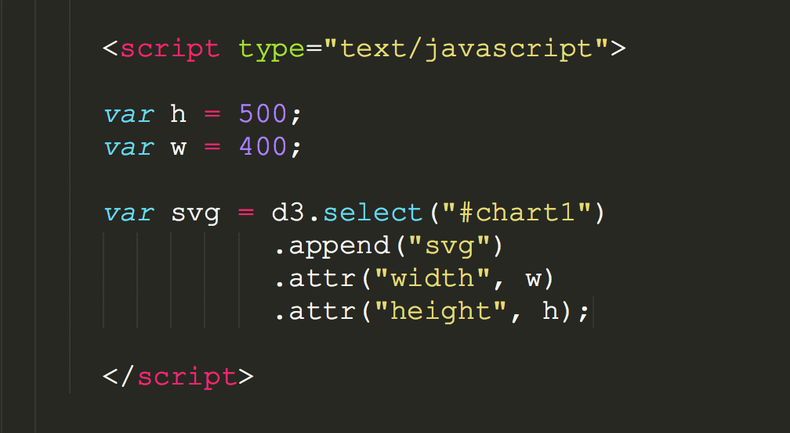
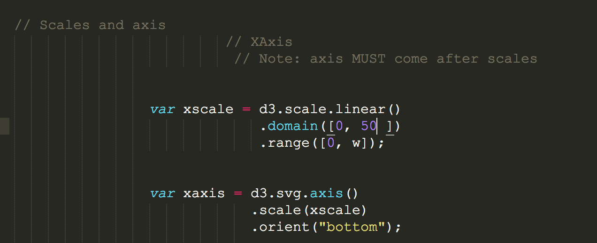
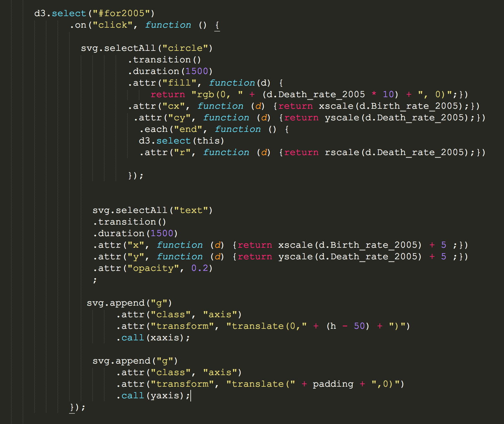

Javascript libraries for data Viz I used/used

- [D3.js](http://d3js.org/)
- [dc.js](https://dc-js.github.io/dc.js/) (based on d3)
- [C3.js](http://c3js.org/) (based on d3)
- [Dimple.js (based in d3)](http://dimplejs.org/examples_index.html)
- sometimes [highcharts](http://www.highcharts.com/)
- [Plot.ly in javascript](https://plot.ly/javascript/) which we going to explore in a minute
- [Leaflet.js](http://leafletjs.com/examples/choropleth.html)
- [Epoch.js](https://github.com/epochjs/epoch) is a real help for real time data visualisations (here a [blog post](https://www.fastly.com/blog/introducing-epoch) about it)
- graph-scroll.js (Simple scrolling events for d3 graphs. Based on stack)
- [scrollmagic.io](http://scrollmagic.io/) - great if you want build any other scrolling events into your visualisation

##Setup:
Before we get started to produce something for the browse window, lets install/download quickly [Yeoman](https://github.com/yeoman/generator-gulp-webapp#readme), which help me to get up an environment really quickly, plus it has a build in local server that updates any changes automatically (much nice to see your visualisation grow this way).

So above all of the libraries mentioned above, the one the possibly allow you to go wild and creative most is D3.js. 

##D3 tutorial: How to see something in the browser?

So lets start simple. In order to see any data bound in the browser, we need out local server to work (or cd in your directory of choice, and run a local server via python ). Once its running, in our HTML standard setup file we include:

`` to access Mike's library. I don't know about you, but I feel in the mood for a Scatterplot. 

1. firs we need to reference our chart with a div in the body via `

`. 
2. The in the <Javascript> tags, we can start with the magic (you can also reference a .js file)

We added three buttons, which will allow the reader later to change the view for the different years:

3. lets set the scene with the svg element, which I always think of as the canvas to draw on. We specify width, height, and a padding value (in pixels). Then we select the div element and append an svg via d3

Check the console in Chrome, there you have it:

##Lets start writing some D3 code:
In the javascript section, the first thing we will add is the svg.

Next we need to load in a dataset. D3 helps us with d3.csv, which turns our CSV data into an array of objects. Console.log it out to your chrome console via `console.log(data)`

Now we set the scales. Domain is the data input, range is the data output.

Same for the y-axis and the radius. to invert and correctly display the radius scale, invest with the root for rscale:

add the circles to your svg

append a group element to display the axis svg elements (the css class added)

now to the fun part, the transitions when you click on the buttons (we do this for every button)

There are many ways to do this, but a smart way would be to add raw javascript in order to write less code. 

Awesome, these are the basics. Lets pause here and motivate you to take it from here. [The book by Scott Murray](http://alignedleft.com/work/d3-book) is helpful to get started. Other resources are listed all [here](https://github.com/mbostock/d3/wiki/Tutorials) - all stated by the Master Chief Mike Bostock.

